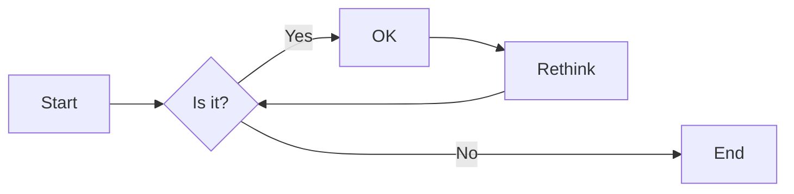
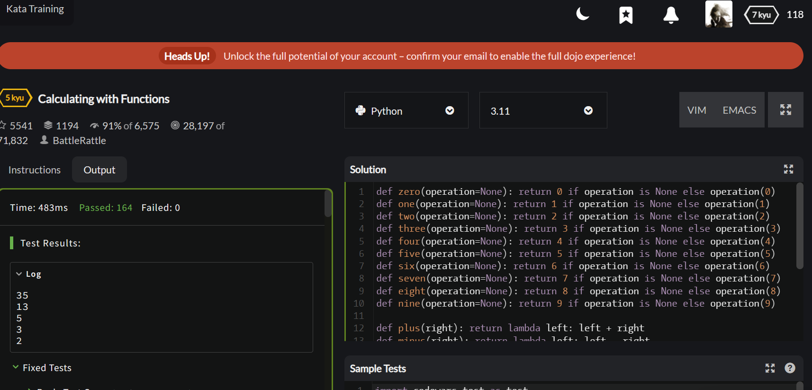
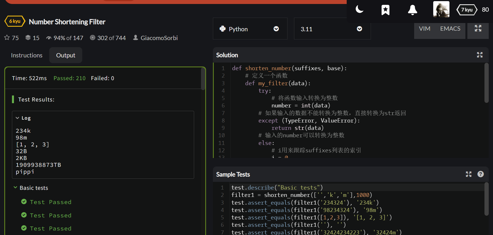
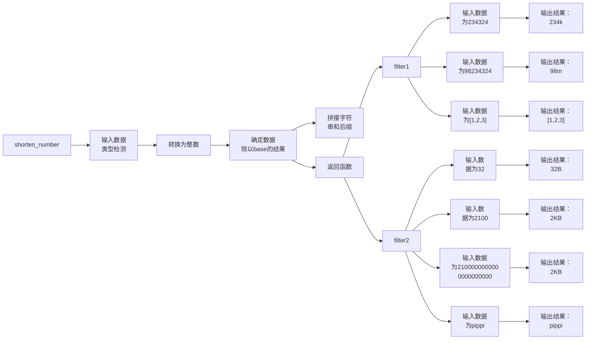

# 实验六 Python函数

班级： 21计科2

学号： B20210302232

姓名： 闫新宇

Github地址：<https://github.com/yanxinyvvv/sysix.git>

CodeWars地址：<https://www.codewars.com/users/闫新宇>

---

## 实验目的

1. 学习Python函数的基本用法
2. 学习lambda函数和高阶函数的使用
3. 掌握函数式编程的概念和实践

## 实验环境

1. Git
2. Python 3.10
3. VSCode
4. VSCode插件

## 实验内容和步骤

### 第一部分

Python函数

完成教材《Python编程从入门到实践》下列章节的练习：

- 第8章 函数

---

### 第二部分

在[Codewars网站](https://www.codewars.com)注册账号，完成下列Kata挑战：

---

#### 第一题：编码聚会1

难度： 7kyu

你将得到一个字典数组，代表关于首次报名参加你所组织的编码聚会的开发者的数据。
你的任务是返回来自欧洲的JavaScript开发者的数量。
例如，给定以下列表：

```python
lst1 = [
  { 'firstName': 'Noah', 'lastName': 'M.', 'country': 'Switzerland', 'continent': 'Europe', 'age': 19, 'language': 'JavaScript' },
  { 'firstName': 'Maia', 'lastName': 'S.', 'country': 'Tahiti', 'continent': 'Oceania', 'age': 28, 'language': 'JavaScript' },
  { 'firstName': 'Shufen', 'lastName': 'L.', 'country': 'Taiwan', 'continent': 'Asia', 'age': 35, 'language': 'HTML' },
  { 'firstName': 'Sumayah', 'lastName': 'M.', 'country': 'Tajikistan', 'continent': 'Asia', 'age': 30, 'language': 'CSS' }
]
```

你的函数应该返回数字1。
如果，没有来自欧洲的JavaScript开发人员，那么你的函数应该返回0。

注意：
字符串的格式将总是"Europe"和"JavaScript"。
所有的数据将始终是有效的和统一的，如上面的例子。

这个卡塔是Coding Meetup系列的一部分，其中包括一些简短易行的卡塔，这些卡塔是为了让人们掌握高阶函数的使用。在Python中，这些方法包括：`filter`, `map`, `reduce`。当然也可以采用其他方法来解决这些卡塔。

[代码提交地址](https://www.codewars.com/kata/coding-meetup-number-1-higher-order-functions-series-count-the-number-of-javascript-developers-coming-from-europe)

---

#### 第二题： 使用函数进行计算

难度：5kyu

这次我们想用函数来写计算，并得到结果。让我们看一下一些例子：

```python
seven(times(five())) # must return 35
four(plus(nine())) # must return 13
eight(minus(three())) # must return 5
six(divided_by(two())) # must return 3
```

要求：

- 从0（"零"）到9（"九"）的每个数字都必须有一个函数。
- 必须有一个函数用于以下数学运算：加、减、乘、除。
- 每个计算都由一个操作和两个数字组成。
- 最外面的函数代表左边的操作数，最里面的函数代表右边的操作数。
- 除法应该是整数除法。

例如，下面的计算应该返回2，而不是2.666666...。

```python
eight(divided_by(three()))
```

代码提交地址：
<https://www.codewars.com/kata/525f3eda17c7cd9f9e000b39>

---

#### 第三题： 缩短数值的过滤器(Number Shortening Filter)

难度：6kyu

在这个kata中，我们将创建一个函数，它返回另一个缩短长数字的函数。给定一个初始值数组替换给定基数的 X 次方。如果返回函数的输入不是数字字符串，则应将输入本身作为字符串返回。

例子：

```python
filter1 = shorten_number(['','k','m'],1000)
filter1('234324') == '234k'
filter1('98234324') == '98m'
filter1([1,2,3]) == '[1,2,3]'
filter2 = shorten_number(['B','KB','MB','GB'],1024)
filter2('32') == '32B'
filter2('2100') == '2KB';
filter2('pippi') == 'pippi'
```

代码提交地址：
<https://www.codewars.com/kata/56b4af8ac6167012ec00006f>

---

#### 第四题： 编码聚会7

难度： 6kyu

您将获得一个对象序列，表示已注册参加您组织的下一个编程聚会的开发人员的数据。

您的任务是返回一个序列，其中包括最年长的开发人员。如果有多个开发人员年龄相同，则将他们按照在原始输入数组中出现的顺序列出。

例如，给定以下输入数组：
```python
list1 = [
  { 'firstName': 'Gabriel', 'lastName': 'X.', 'country': 'Monaco', 'continent': 'Europe', 'age': 49, 'language': 'PHP' },
  { 'firstName': 'Odval', 'lastName': 'F.', 'country': 'Mongolia', 'continent': 'Asia', 'age': 38, 'language': 'Python' },
  { 'firstName': 'Emilija', 'lastName': 'S.', 'country': 'Lithuania', 'continent': 'Europe', 'age': 19, 'language': 'Python' },
  { 'firstName': 'Sou', 'lastName': 'B.', 'country': 'Japan', 'continent': 'Asia', 'age': 49, 'language': 'PHP' },
]
```

您的程序应该返回如下结果：

```python
[
  { 'firstName': 'Gabriel', 'lastName': 'X.', 'country': 'Monaco', 'continent': 'Europe', 'age': 49, 'language': 'PHP' },
  { 'firstName': 'Sou', 'lastName': 'B.', 'country': 'Japan', 'continent': 'Asia', 'age': 49, 'language': 'PHP' },
]
```

注意：

- 输入的列表永远都包含像示例中一样有效的正确格式的数据，而且永远不会为空。

代码提交地址：
<https://www.codewars.com/kata/582887f7d04efdaae3000090>

---

#### 第五题： Currying versus partial application

难度： 4kyu

[Currying versus partial application](https://2ality.com/2011/09/currying-vs-part-eval.html)是将一个函数转换为具有更小arity(参数更少)的另一个函数的两种方法。虽然它们经常被混淆，但它们的工作方式是不同的。目标是学会区分它们。

Currying

是一种将接受多个参数的函数转换为以每个参数都只接受一个参数的一系列函数链的技术。

Currying接受一个函数：

```python
f：X × Y → R
```

并将其转换为一个函数：

```python
f'：X → (Y → R)
```

我们不再使用两个参数调用f，而是使用第一个参数调用f'。结果是一个函数，然后我们使用第二个参数调用该函数来产生结果。因此，如果非curried f被调用为：

```python
f(3, 5)
```

那么curried f'被调用为：

```python
f'(3)(5)
```

示例
给定以下函数：

```python
def add(x, y, z):
  return x + y + z
```

我们可以以普通方式调用：

```python
add(1, 2, 3) # => 6
```

但我们可以创建一个curried版本的add(a, b, c)函数：

```python
curriedAdd = lambda a: (lambda b: (lambda c: add(a,b,c)))
curriedAdd(1)(2)(3) # => 6
```

Partial application
是将一定数量的参数固定到函数中，从而产生另一个更小arity(参数更少)的函数的过程。

部分应用接受一个函数：

```python
f：X × Y → R
```

和一个固定值x作为第一个参数，以产生一个新的函数

```python
f'：Y → R
```

f'与f执行的操作相同，但只需要填写第二个参数，这就是其arity比f的arity少一个的原因。可以说第一个参数绑定到x。

示例:

```python
partialAdd = lambda a: (lambda *args: add(a,*args))
partialAdd(1)(2, 3) # => 6
```

你的任务是实现一个名为curryPartial()的通用函数，可以进行currying或部分应用。

例如：

```python
curriedAdd = curryPartial(add)
curriedAdd(1)(2)(3) # => 6

partialAdd = curryPartial(add, 1)
partialAdd(2, 3) # => 6
```

我们希望函数保持灵活性。

所有下面这些例子都应该产生相同的结果：

```python
curryPartial(add)(1)(2)(3) # =>6 
curryPartial(add, 1)(2)(3) # =>6 
curryPartial(add, 1)(2, 3) # =>6 
curryPartial(add, 1, 2)(3) # =>6 
curryPartial(add, 1, 2, 3) # =>6 
curryPartial(add)(1, 2, 3) # =>6 
curryPartial(add)(1, 2)(3) # =>6 
curryPartial(add)()(1, 2, 3) # =>6 
curryPartial(add)()(1)()()(2)(3) # =>6 

curryPartial(add)()(1)()()(2)(3, 4, 5, 6) # =>6 
curryPartial(add, 1)(2, 3, 4, 5) # =>6 

curryPartial(curryPartial(curryPartial(add, 1), 2), 3) # =>6
curryPartial(curryPartial(add, 1, 2), 3) # =>6
curryPartial(curryPartial(add, 1), 2, 3) # =>6
curryPartial(curryPartial(add, 1), 2)(3) # =>6
curryPartial(curryPartial(add, 1)(2), 3) # =>6
curryPartial(curryPartial(curryPartial(add, 1)), 2, 3) # =>6
```

代码提交地址：
<https://www.codewars.com/kata/53cf7e37e9876c35a60002c9>

---

### 第三部分

使用Mermaid绘制程序流程图

安装VSCode插件：

- Markdown Preview Mermaid Support
- Mermaid Markdown Syntax Highlighting

使用Markdown语法绘制你的程序绘制程序流程图（至少一个），Markdown代码如下：


显示效果如下：



查看Mermaid流程图语法-->[点击这里](https://mermaid.js.org/syntax/flowchart.html)

使用Markdown编辑器（例如VScode）编写本次实验的实验报告，包括[实验过程与结果](#实验过程与结果)、[实验考查](#实验考查)和[实验总结](#实验总结)，并将其导出为 **PDF格式** 来提交。

## 实验过程与结果

### 第一部分 Python列表操作和if语句

**练习8.1：** 消息：编写一个名为display_message()的函数，让它打印一个句子，指出本章的主题是什么。调用这个函数，确认显示的消息正确无误。
```python
def display_message():
    print("传递实参")
display_message()
```

**练习8.2：** 喜欢的书：编写一个名为favorite_book()的函数，其中包含一个名为title的形参。让这个函数打印一条像下面这样的消息：One of my favorite books is Alice in Wonderland.调用这个函数，并将一本书的书名作为实参传递给它。
```python
def favorite_book(book_name):
    print("One of my favorite books is "+book_name.title())
favorite_book('Alice in wonderland')
```

**练习8.3：** T恤：编写一个名为make shirt()的函数，它接受一个尺码以及要印到T恤上的字样。这个函数应该打印一个句子，简要地说明T恤的尺码和字样。先使用位置实参调用这个函数来制作一件T恤，再使用关键字实参来调用这个函数。
```python
def make_shirt(size,characters):
    print("This T-shirt's size is "+ size)
    print("\nWith "+ characters.upper() +' on it.')
make_shirt(size="M",characters="GOOD LUCK")#关键字实参
make_shirt("M","GOOD LUCK")#位置实参
```

**练习8.4：** 大号T恤：修改make_shirt()函数，使其在默认情况下制作一件印有“I love Python”字样的大号T恤。调用这个函数分别制作一件印有默认字样的大号T恤，一件印有默认字样的中号T恤，以及一件印有其他字样的T恤(尺码无关紧要)。
```python
def make_shirt(size = "L",characters = "I Love Python"):
    print("This T-shirt's size is "+ size)
    print("With "+ characters.upper() +' on it.\n')
make_shirt()
make_shirt(size="M")
make_shirt(characters="GOOD LUCK")
```

**练习8.5：** 城市：编写一个名为describe_city()的函数，它接受一座城市的名字以及该城市所属的国家。这个函数应该打印一个像下面这样简单的句子：Reykjavik is in Iceland.给用于存储国家的形参指定默认值。为三座不同的城市调用这个函数，其中至少有一座城市不属于默认的国家。
```python
def describe_city(name,country = "A"):
    print(name.title()+" is in "+country)
describe_city(name = "B")
describe_city(name = "C",country="D")
describe_city(name="E", country="F")
```

**练习8.6：** 城市名：编写一个名为city_country()的函数，它接受城市的名称及其所属的国家。这个函数应返回一个格式类似于下面的字符串：
"Santiago, Chile"，至少使用三个城市-国家对调用这个函数，并打印它返回的值。
```python
def city_country(city,country):
    full = city+","+country
    return  full.title()
Full = city_country('santiago','chile')
print(Full)
```

**练习8.7：** 专辑：编写一个名为make_album()的函数，它创建一个描述音乐专辑的字典。这个函数应接受歌手名和专辑名，并返回一个包含这两项信息的字典。使用这个函数创建三个表示不同专辑的字典，并打印每个返回的值，以核实字典正确地存储了专辑的信息。给make_album()函数添加一个默认值为None的可选形参，以便存储专辑包含的歌曲数。如果调用这个函数时指定了歌曲数，就将这个值添加到表示专辑的字典中。调用这个函数，并至少在一次调用中指定专辑包含的歌曲数。
```python
def make_album(singer,album,number =""):
    infor = {'singer':singer,'album':album}
    if number:
        infor['number'] = number
    return infor
music = make_album('Jack','Long Time')
print(music)
music = make_album('Jack','Short Time',3)
print(music)
music = make_album('Jack','No Time',1)
print(music)
```

**练习8.8：** 用户的专辑：在为练习8.7编写的程序中，编写一个while循环，让用户输入歌手名和专辑名。获取这些信息后，使用它们来调用make_album()函数并将创建的字典打印出来。在这个while循环中，务必提供退出途径。
```python
def make_album(singer,album,number =""):
    infor = {'singer':singer,'album':album}
    if number:
        infor['number'] = number
    return infor
while True:
    print("Please input your favorite singer and album:")
    print("(enter 'q' at any time to quit)")
    singer = input("The singer:")
    if singer == 'q':
        break
    album = input("The album:")
    if album == 'q':
        break
    prefer = make_album(singer,album)#作为形参名称传递时，不需要添加引号；作为形参内容传递时，添加上引号
    print("Here is your favorite singer and album: "+ str(prefer))
```

**练习8.9：** 消息：创建一个列表，其中包含一系列简短的文本消息。将这个列表传递给一个名为show_messages()的函数，这个函数会打印列表中的每条文本消息。
```python
def show_magicians(names):
    """打印出每个魔术师的名字"""
    for name in names:
        print("Hey,your name is "+ name)
magicians = ["Linda","Max","Caroline"]
show_magicians(magicians)
```

**练习8.10：** 发送消息：在为练习8.9编写的程序中，编写一个名为send_messages()的函数，将每条消息都打印出来并移到一个名为sent_messages 的列表中。调用send_messages()函数，再将两个列表都打印出来，确认把消息移到了正确的列表中。
```python
def show_magicians(original_names,modi_names):
    """打印出每个魔术师的名字"""
    while original_names:
        current_name = original_names.pop()
        print("Hey "+ current_name)
        modi_names.append(current_name)
def add_The_Great(modi_names):
    """为每个魔术师名字增加The Great"""
    modified_names = []
    while modi_names:
        current_name = modi_names.pop()
        modified_names.append("The Great: " + current_name)
    print(modified_names)
original_names = ["Linda","Max","Caroline"]
modi_names = []
show_magicians(original_names,modi_names)
add_The_Great(modi_names)
```

**练习8.11：** 消息归档：修改为练习8.10编写的程序，在调用函数send_messages()时，向它传递消息列表的副本。调用send_messages()函数后，将两个列表都打印出来，确认原始列表保留了所有的消息。
```python
def make_great(magicians):
    for i in range(len(magicians)):
        magicians[i] = "the Great " + magicians[i]
    return magicians
 
def show_magicians(magicians):
    for magician in magicians:
        print(magician)
 
magicians = ["David Copperfield", "Criss Angel", "David Blaine"]
great_magicians = make_great(magicians[:])
show_magicians(great_magicians)
show_magicians(magicians)#调用副本，原列表没有发生改变
great_magicians = make_great(magicians)
show_magicians(great_magicians)
show_magicians(magicians)#调用原来的列表，列表发生了改变
```

**练习8.12：** 三明治：编写一个函数，它接受顾客要在三明治中添加的一系列食材。这个函数只有一个形参(它收集函数调用中提供的所有食材)，并打印一条消息，对顾客点的三明治进行概述。调用这个函数三次，每次都提供不同数量的实参。
```python
def make_sandwiches(*toppings):
    """概述要制作的三明治食材"""
    print('\nMaking a sandwich with the following toppings: ')
    for topping in toppings:
        print('-'+topping)
make_sandwiches('chicken','egg','vegetables','bread')
```

**练习8.13：** 用户简介：复制前面的程序 user profile.py，在其中调用build_profile()来创建有关你的简介。在调用这个函数时，指定你的名和姓，以及三个用来描述你的键值对。
```python
def build_profile(first,last,**userinfo):
    profit={}
    profit['first_name']=first
    profit['last_name']=last
    for key,value in userinfo.items():
        profit[key]=value
    return profit
user1=build_profile('xiao','ming',like='guitar',phone='1231',home='7 stress')
print(user1)
```

**练习8.14：** 汽车：编写一个函数，将一辆汽车的信息存储在字典中。这个函数总是接受制造商和型号，还接受任意数量的关键字实参。在调用这个函数时，提供必不可少的信息，以及两个名值对，如颜色和选装配件。这个函数必须能够像下面这样调用：car = make_car('subaru', 'outback', color='blue', tow_package=True)，打印返回的字典，确认正确地处理了所有的信息。
```python
def make_car(manufacturer,model,**carinfor):
    car={}
    car['manufacturer']=manufacturer
    car['model']=model
    for key,value in carinfor.items():
        car[key]=value
    return car
car=make_car('subaru','outback',color='blue',two_package=True)
print(car)
```

### 第二部分 Codewars Kata挑战

**第2题：使用函数进行计算**
```python
def zero(operation=None): return 0 if operation is None else operation(0)
def one(operation=None): return 1 if operation is None else operation(1)
def two(operation=None): return 2 if operation is None else operation(2)
def three(operation=None): return 3 if operation is None else operation(3)
def four(operation=None): return 4 if operation is None else operation(4)
def five(operation=None): return 5 if operation is None else operation(5)
def six(operation=None): return 6 if operation is None else operation(6)
def seven(operation=None): return 7 if operation is None else operation(7)
def eight(operation=None): return 8 if operation is None else operation(8)
def nine(operation=None): return 9 if operation is None else operation(9)

def plus(right): return lambda left: left + right
def minus(right): return lambda left: left - right
def times(right): return lambda left: left * right
def divided_by(right): return lambda left: left // right  # 整数除法

# 测试例子
print(seven(times(five())))  # 应该输出 35
print(four(plus(nine())))  # 应该输出 13
print(eight(minus(three())))  # 应该输出 5
print(six(divided_by(two())))  # 应该输出 3
print(eight(divided_by(three())))  # 应该输出 2

```
**运行结果**


**第3题：缩短数值的过滤器(Number Shortening Filter)**
```python
def shorten_number(suffixes, base):
    # 定义一个函数
    def my_filter(data):
        try:
            # 将函数输入转换为整数
            number = int(data)
        # 如果输入的数据不能转换为整数，直接转换为str返回
        except (TypeError, ValueError):
            return str(data)
        # 输入的number可以转换为整数
        else:
            # i用来跟踪suffixes列表的索引
            i = 0
            # 每次循环将输入的数字除以base，索引i+1
            # 如果除以base等于0或者索引等于len(suffixes)-1，结束循环
            while number//base > 0 and i < len(suffixes)-1:
                number //= base
                i += 1
            return str(number) + suffixes[i]     
    # 返回值是一个函数
    return my_filter
filter1 = shorten_number(['','k','m'],1000)
print(filter1('234324'))  # == '234k'
print(filter1('98234324')) # == '98m'
print(filter1([1,2,3])) # == '[1,2,3]'
filter2 = shorten_number(['B','KB','MB','GB', 'TB'],1024)
print(filter2('32')) # == '32B'
print(filter2('2100'))  # == '2KB';
print(filter2('2100000000000000000000'))  # == '2KB';
print(filter2('pippi')) # == 'pippi'
```
**运行结果**


### 第三部分 使用Mermaid绘制程序流程图

**第3题：缩短数值的过滤器(Number Shortening Filter)**
```
flowchart LR  
A["shorten_number"] -->B["输入数据\n类型检测"]  
B --> C["转换为整数"]  
C --> D["确定数据\n除以base的结果"]  
D --> E["拼接字符\n串和后缀"]  
D --> F["返回函数"]  
F --> G["filter1"]  
F --> H["filter2"]  
G --> I["输入数据\n为234324"]  
G --> J["输入数据\n为98234324"]  
G --> K["输入数据\n为[1,2,3]"]  
H --> L["输入数\n据为32"]  
H --> M["输入数\n据为2100"]  
H --> N["输入数据\n为210000000000\n0000000000"]  
H --> O["输入数据\n为pippi"]  
I --> P["输出结果：\n234k"]  
J --> Q["输出结果：\n98m"]  
K --> R["输出结果：\n[1,2,3]"]  
L --> S["输出结果：\n32B"]  
M --> T["输出结果：\n2KB"]  
N --> U["输出结果：\n2KB"]  
O --> V["输出结果：\npippi"]
```



## 实验考查

1. 什么是函数式编程范式？
<br/>函数式编程是一种编程范式，它将计算过程视为一系列数学函数的求值。在函数式编程中，函数是一等公民，这意味着函数可以作为参数传递给其他函数，也可以作为其他函数的返回值。函数式编程的核心思想是通过组合纯函数（没有副作用的函数）来构建程序。它强调将计算过程看作是函数之间的转换而不是状态的改变。

2. 什么是lambda函数？请举例说明。
<br/>Lambda函数是一种匿名函数，也就是没有名字的函数。它们常常用在短小的函数或者作为参数传递给其他函数。

```python
# 这是一个lambda函数，它接受两个参数，并返回它们的和  
add = lambda x, y: x + y  
# 使用这个lambda函数  
result = add(5, 3)  
print(result)  # 输出8
```

3. 什么是高阶函数？常用的高阶函数有哪些？这些高阶函数如何工作？使用简单的代码示例说明。
<br/>①高阶函数是接受一个或多个函数作为输入（参数）或返回一个函数作为结果的函数,就是使用其他函数进行某种计算的函数；②常用的高阶函数有map()、filter()、reduce()、compose()等；③通过几个代码示例来说明这些高阶函数是如何工作的：

```python
# 定义一个函数，用于计算平方  
def square(x):  
    return x ** 2  
# 使用map函数，将上面的函数应用于列表的每一个元素  
numbers = [1, 2, 3, 4, 5]  
squared_numbers = map(square, numbers)  
# map将结果作为迭代器返回，所以我们需要将其转换为列表以打印输出  
print(list(squared_numbers))  # 输出：[1, 4, 9, 16, 25]
```

```python
# 定义一个函数，用于判断一个数是否为偶数  
def is_even(x):  
    return x % 2 == 0  
# 使用filter函数，将上面的函数应用于列表的每一个元素，过滤出偶数  
numbers = [1, 2, 3, 4, 5]  
even_numbers = filter(is_even, numbers)  
# filter将结果作为迭代器返回，所以我们需要将其转换为列表以打印输出  
print(list(even_numbers))  # 输出：[2, 4]
```

```python
# 定义一个函数，用于计算两个数的乘积  
def multiply(x, y):  
    return x * y  
# 使用reduce函数，将上面的函数应用于列表的每一个前后的元素进行乘法运算（累积计算）  
numbers = [1, 2, 3, 4, 5]  
product = reduce(multiply, numbers)  
print(product)  # 输出：120 (1*2*3*4*5)
```

## 实验总结
通过本次实验我学习到了函数式编程范式是一种基于数学函数的编程方法，这种范式强调纯函数的组合，即将计算过程视为函数之间的转换而不是状态的改变。Lambda函数是匿名函数，通常用于短小的函数或作为参数传递给其他函数。高阶函数是接受一个或多个函数作为输入或返回一个函数作为结果的函数。常见的Python高阶函数包括map()、filter()、reduce()和compose()等。这些函数可以接受一个函数和一个或多个值（例如列表的元素），并将该函数应用于这些值。而在实验中遇到的问题也通过询问老师、同学得到解决。